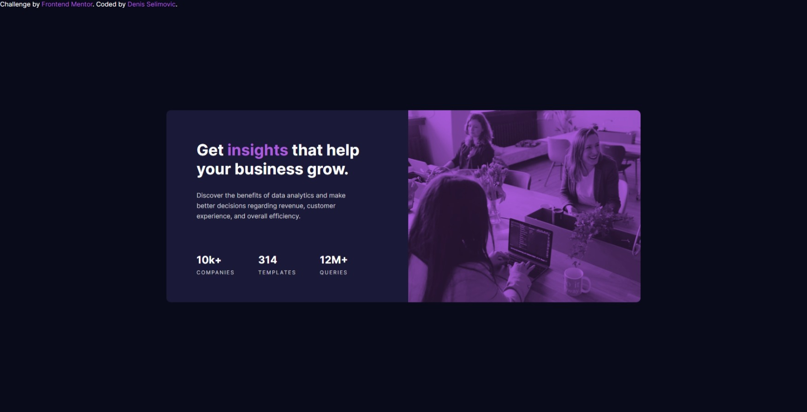

# Frontend Mentor - Stats preview card component solution

This is a solution to the [Stats preview card component challenge on Frontend Mentor](https://www.frontendmentor.io/challenges/stats-preview-card-component-8JqbgoU62). Frontend Mentor challenges help you improve your coding skills by building realistic projects. 

## Table of contents

- [Overview](#overview)
  - [The challenge](#the-challenge)
  - [Screenshot](#screenshot)
  - [Links](#links)
- [My process](#my-process)
  - [Built with](#built-with)
  - [What I learned](#what-i-learned)
  - [Continued development](#continued-development)
  - [Useful resources](#useful-resources)
- [Author](#author)

## Overview

### The challenge

Users should be able to:

- View the optimal layout depending on their device's screen size

### Screenshot



### Links

- Solution URL: https://github.com/dselimovic02/stats-preview-card
- Live Site URL: https://dselimovic02.github.io/stats-preview-card

## My process

### Built with

- Semantic HTML5 markup
- CSS custom properties
- Flexbox

### What I learned

In this project I have learned and/or practiced:
  -HTML
  -CSS
    -Flex Properties
    -Responsivnes
    -Layout


What I am really proud of is solution on how to get that image looking as close as possible to refference desings.

```html
<!-- PICTURE -->
      <div class="picture">
        <div class="lighten"></div><!-- Lightens it up a little bit to match the project example as close as possible -->
      </div>
```
```css
/*PICTURE*/
.picture{
    height: 100%;
    width: 49%;
    background-color: var(--accent);
    background-image: url(images/image-header-desktop.jpg);
    background-position: center;
    background-size: cover;
    background-repeat: no-repeat;
    background-blend-mode:multiply;
    position: relative;
    border-radius: 0 1rem 1rem 0;
}
.lighten{
    background: var(--accent);
    width: 100%;
    height: 100%;
    position: absolute;
    top: 0;
    left: 0;
    opacity: 0.2;
    border-radius: 0 1rem 1rem 0;
}
```
```js
function doNothing();
function noJSHere(){
  doNothing();
}
noJSHere();
```

### Continued development

I am looking forward to finishing all the NEWBIE challenges so I can progress to JUNIOR ones.

### Useful resources

Did it all by myself! :D

## Author

- Frontend Mentor - [https://www.frontendmentor.io/profile/dselimovic02](https://www.frontendmentor.io/profile/yourusername)
